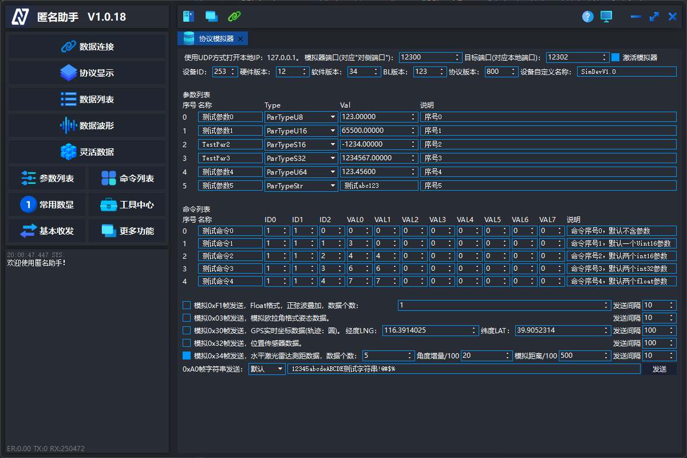

# 匿名助手

#### 为什么设计本软件：
相信大家在嵌入式等调试过程中，一定会遇到 **数据的实时显示、数据的变化波形绘制、参数调整、命令触发、文本log信息显示** 等需要。回想当年，自己刚开始学习嵌入式，遇到类似情景，只会使用 **原始的串口助手** ，数据显示靠发送 **字符串** ，参数调整需要用 **下载器** 改源码，命令需要用板子上的 **实体按键** 触发，使用了各种 **简陋、原始** 的方法，实现效果也非常不尽人意。想想还是自己大学做智能车的时候，就开始设计并编写上位机了，真正是 **面对需求开发** ，如何 **有效的传输数据** ，如何 **方便的展示数据** ，可以说上位机的贡献，是最终国一奖状的功勋基石。
后来开始设计匿名团队自己的上位机，经历了十余年的迭代，您现在看到的，就是匿名团队最新的上位机作品，特点如下：
1.  **高效** ，使用C++实现，非解释语言，程序运行高效
1.  **简单** ，匿名助手使用的匿名协议非常简洁易懂，方便移植，比如您只需要匿名助手显示波形，那么只需要一个函数发送数据即可
1.  **拓展性强** ，匿名助手的参数读写、命令触发，其中的参数和命令，均由下位机定义，上位机读取信息后进行显示，只需要在您下位机代码中按格式定义好参数和命令的信息，即可由匿名助手进行读写操作
1.  **灵活性高** ，匿名助手支持各类数据的解析和显示，无符号、有符号8位、16位、32位、浮点数，参数读写支持无符号、有符号8位、16位、32位、浮点数和字符串类型，命令触发功能支持无参数命令触发、带参数命令触发，命令参数支持无符号、有符号8位、16位、32位、浮点数，单个命令支持多个参数
1.  **功能丰富** ，匿名助手实现了数据值显示、数据波形绘制、数据波形分析、参数读写、命令触发、3D模型显示、雷达数据显示、地图显示、固件升级等等丰富的功能，极大的方便各类调试场景

#### 程序主界面

#### 数据解析

#### 数据波形

#### 模型显示

#### 参数列表

#### 命令列表

#### 灵活数据

#### 常用数显

#### 工具中心

#### 实时FFT分析

#### 地图显示

#### 3D轨迹显示

#### 雷达数据显示

#### 协议模拟器

有人说“软件越粉，参数越稳”，所以，加上了网友制作的粉色皮肤《猛男粉》

#### 视频介绍：[视频介绍](https://www.bilibili.com/video/BV1sb411f7VF/?vd_source=85d0827f0b576f52b68a8b795e49826a#reply225753889)

